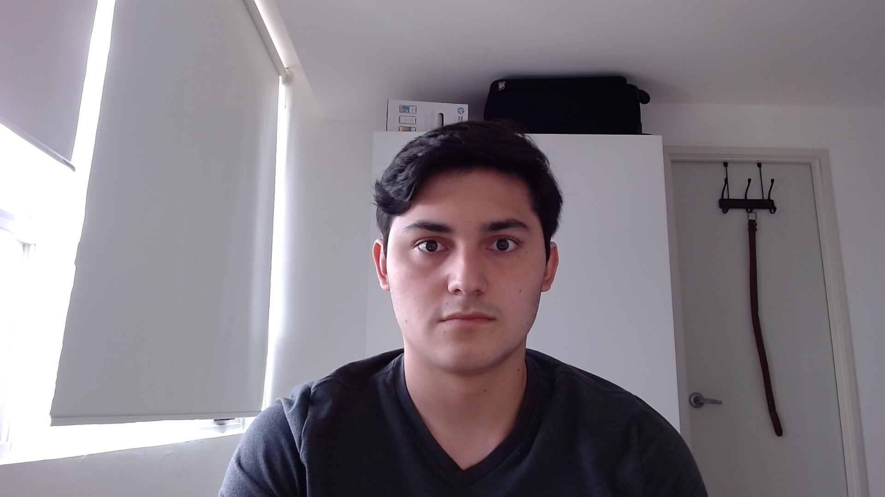

# SemanaTec26-10-21
# Ricardo Jose Olmedo
1. Computacion
2. Matematicas
3. Historia del arte
4. Fisica

[ITESM](https://tec.mx/es)

*Vamos a desayunar a Toks, tacos Pioneros a saltillo*

- Tacos de rajas con queso
- Tacos de Barbacoa
- Tacos de Barbacoa de Borrego
- tacos de suadero
- tacos de suaperro
- Tacos al Pastor

- Emiliano
- Aurturo
- Santiago Minga Ecuador
- Ricardo Olmedo El Salvador

print("Hola")
print("Adios!!")
print("Este videojuego estuvo padrisimo")

"""Paint, for drawing shapes.

Exercises

1. Add a color.
2. Complete circle.
3. Complete rectangle.
4. Complete triangle.
5. Add width parameter.

"""

from turtle import *

from freegames import vector

def line(start, end):
    "Draw line from start to end."
    up()
    goto(start.x, start.y)
    down()
    goto(end.x, end.y)

def square(start, end):
    "Draw square from start to end."
    up()
    goto(start.x, start.y)
    down()
    begin_fill()

    for count in range(4):
        forward(end.x - start.x)
        left(90)

    end_fill()

def circle(start, end):
    "Draw circle from start to end."
    pass  # TODO

def rectangle(start, end):
    "Draw rectangle from start to end."
    pass  # TODO

def triangle(start, end):
    "Draw triangle from start to end."
    pass  # TODO

def tap(x, y):
    "Store starting point or draw shape."
    start = state['start']

    if start is None:
        state['start'] = vector(x, y)
    else:
        shape = state['shape']
        end = vector(x, y)
        shape(start, end)
        state['start'] = None

def store(key, value):
    "Store value in state at key."
    state[key] = value

state = {'start': None, 'shape': line}
setup(420, 420, 370, 0)
onscreenclick(tap)
listen()
onkey(undo, 'u')
onkey(lambda: color('black'), 'K')
onkey(lambda: color('white'), 'W')
onkey(lambda: color('green'), 'G')
onkey(lambda: color('blue'), 'B')
onkey(lambda: color('red'), 'R')
onkey(lambda: store('shape', line), 'l')
onkey(lambda: store('shape', square), 's')
onkey(lambda: store('shape', circle), 'c')
onkey(lambda: store('shape', rectangle), 'r')
onkey(lambda: store('shape', triangle), 't')
done()

| Tables        | Are           | Cool  |
| ------------- |:-------------:| -----:|
| col 3 is      | right-aligned | $1600 |
| col 2 is      | centered      |   $12 |
| zebra stripes | are neat      |    $1 |

Markdown | Less | Pretty
--- | --- | ---
Still | `renders` | *nicely*
1 | 2 | 3

<dl>
  <dt>Definition list</dt>
  <dd>Is something people use sometimes.</dd>

  <dt>Markdown in HTML</dt>
  <dd>Does not work *very* well. Use HTML <em>tags</em>.</dd>
</dl>

*

_
